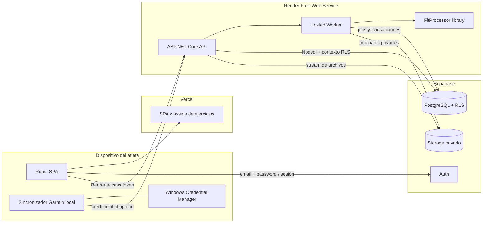
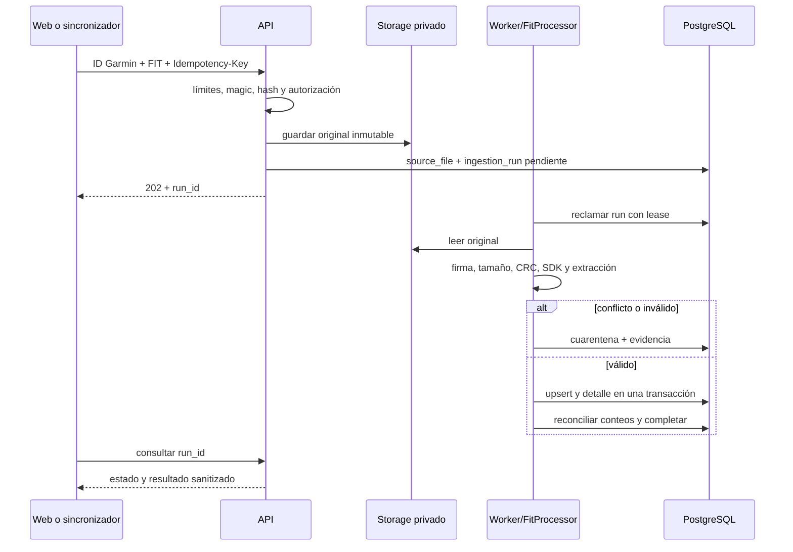

# Arquitectura — Running Performance App

**Versión:** `APP-003-v3-2026-08-14`  
**Estado:** aprobada para planificación  
**Contratos:** `APP-001-v5-2026-08-14` y `APP-002-v3-2026-08-12`

## 1. Decisión ejecutiva

El MVP será un **monolito modular con worker de fondo**. Conserva tres piezas lógicas, pero el perfil gratuito las publica como dos desplegables:

1. una SPA React + TypeScript + Vite en Vercel;
2. un único Web Service ASP.NET Core sobre .NET 10 LTS que aloja la API REST y el Worker como `BackgroundService` en el mismo proceso.

El Worker sigue siendo un componente aislado y comprobable que comparte dominio e infraestructura con la API. `RunningPerformance.Worker` ofrece además un host de consola para ejecución local, CI y una migración futura a proceso separado, pero no se publica como segundo servicio mientras rija costo cero.

Supabase hospedará Auth, PostgreSQL y Storage. El frontend usará Supabase directamente solo para autenticación; todas las operaciones de dominio pasarán por la API. La API y el Worker accederán a PostgreSQL con Npgsql y roles dedicados de mínimo privilegio. El esquema se administra únicamente mediante SQL y Supabase CLI.

No se crean microservicios, funciones Edge, una segunda base, un broker externo ni una capa GraphQL en el MVP.

## 2. Diagrama de componentes y confianza



Límites de confianza:

- navegador y sincronizador son clientes no confiables;
- API y Worker son procesos confiables, pero cada operación conserva propietario y correlation ID;
- la identidad web se obtiene exclusivamente del claim `sub` de un JWT Supabase validado;
- la identidad del sincronizador se obtiene exclusivamente de una credencial revocable asociada a `sync_clients`;
- rutas, IDs de propietario y estado de ingestión nunca se aceptan como autoridad desde el payload.

## 3. Tecnologías y responsabilidades

| Componente | Tecnología | Responsabilidad |
|---|---|---|
| Web | React, TypeScript, Vite | navegación, formularios, calendario, dashboard, guía de ejercicios y estado de trabajos |
| Autenticación web | `@supabase/supabase-js` | email/contraseña, recuperación, refresh y cierre de sesión; no consulta tablas de dominio |
| API | ASP.NET Core .NET 10 LTS | JWT, autorización, DTOs, validación, reglas de negocio, uploads, comandos y consultas |
| Application/Domain | proyectos .NET compartidos | casos de uso, reglas de precedencia, P1–P5, decisiones y contratos sin dependencia web |
| Infraestructura | Npgsql y SQL explícito | unidades de trabajo, RLS, consultas, COPY/lotes, Storage y reloj/identificadores |
| Worker | .NET `BackgroundService` en API; host de consola separado para local/CI | CSV, FIT, reprocesos, evaluaciones, exportaciones, reintentos y reconciliación |
| FIT | librería extraída de `Tools/FitProcessor` | validación SDK, extracción determinista y contrato canónico |
| Base | Supabase PostgreSQL | fuente de verdad, RLS, constraints, auditoría, jobs y vistas |
| Archivos | Supabase Storage privado | CSV/FIT originales y exportaciones temporales |
| Assets de ejercicios | frontend/Vercel CDN | ilustraciones no personales, versionadas y con licencia |

.NET 10 se fija por ser la LTS activa; cada build debe usar el último parche compatible. No se seleccionan versiones exactas de paquetes hasta `APP-004`.

## 4. Estructura propuesta del repositorio `App/`

```text
App/
├── src/
│   ├── web/                         React + TypeScript + Vite
│   └── backend/
│       ├── RunningPerformance.Api/
│       ├── RunningPerformance.Worker/
│       ├── RunningPerformance.Application/
│       ├── RunningPerformance.Domain/
│       ├── RunningPerformance.Infrastructure/
│       └── RunningPerformance.Fit/
├── tests/
│   ├── backend-unit/
│   ├── backend-integration/
│   ├── web/
│   └── e2e/
├── supabase/
│   ├── migrations/
│   ├── tests/database/
│   ├── seed.sql                     solo datos sintéticos
│   └── config.toml
├── docs/
└── .github/workflows/
```

Se conserva una sola solución .NET. Los módulos funcionales son `Profile`, `Races`, `Planning`, `Exercises`, `Activities`, `Ingestion`, `Evaluation`, `Decisions` y `Exports`. Cada módulo agrupa endpoints, casos de uso, DTOs y persistencia; no se crea un proyecto por módulo.

En producción gratuita, `RunningPerformance.Api` registra el Worker compartido como hosted service. `RunningPerformance.Worker` contiene solamente el host alternativo; la implementación de jobs vive en Application/Infrastructure y no se duplica.

## 5. Frontend React

### Organización

- `app/`: router, proveedores, sesión, manejo global de errores y layout.
- `features/`: módulos funcionales sin dependencias circulares.
- `shared/`: componentes visuales, formatos, unidades, accesibilidad y cliente API generado.
- `assets/exercises/`: imágenes WebP/AVIF o SVG permitidas, organizadas por slug/revisión.

La navegación y las gráficas se cargan por ruta para evitar heredar el bundle monolítico del prototipo. El servidor realiza filtrado, orden, paginación y agregados; React no descarga el historial completo para filtrar en memoria.

### Estado y contratos

- estado remoto mediante una librería de consultas con caché y cancelación;
- estado de formulario local con validación equivalente al contrato OpenAPI;
- cliente TypeScript generado desde OpenAPI para evitar DTOs duplicados manualmente;
- cursor estable para actividades y auditoría;
- fechas ISO en transporte y formateo con la zona configurada del atleta;
- distancias, tiempos y ritmos se presentan desde valores numéricos, no se almacenan como texto.

### iPhone y PC

- diseño mobile-first desde 320 CSS px, con `viewport-fit=cover` y safe-area insets en iPhone;
- navegación compacta inferior o menú móvil en iPhone y navegación lateral/superior en PC;
- objetivos táctiles mínimos de 44 × 44 CSS px, inputs con fuente mínima de 16 px para evitar zoom involuntario en iOS y acciones primarias alcanzables con una mano;
- tablas densas se transforman en tarjetas/resúmenes móviles; el detalle completo permanece disponible sin scroll horizontal del layout;
- gráficas fluidas con leyenda/tooltip accesibles y alternativa tabular;
- carga manual compatible con Files/Share Sheet de iOS y selector/drag-and-drop en PC;
- los flujos críticos se prueban en Safari de las dos versiones mayores de iOS soportadas por Apple y en versiones actuales de Chrome/Edge para PC;
- La instalación en la pantalla de inicio del iPhone forma parte del MVP: manifest, iconos, metadatos iOS, `display: standalone`, guía en Perfil y publicación HTTPS. Service Worker, caché de datos y operación offline permanecen fuera del MVP.

### Guía de ejercicios

Una sesión de fuerza, movilidad o pliometría abre sus bloques y ejercicios en orden. Cada tarjeta muestra dosificación, descripción breve y hasta dos imágenes con `alt_text`. El texto sigue visible si el asset falla. Las imágenes iniciales se empaquetan con el frontend y usan URI con revisión/hash para caché inmutable; PostgreSQL conserva la referencia y licencia.

## 6. Autenticación y sesiones web

- Supabase Auth usa email y contraseña. El email es el identificador de acceso del único atleta; `display_name` sigue separado en el perfil.
- El registro público queda deshabilitado. La cuenta inicial se crea de forma administrativa y fuera del frontend.
- La SPA administra la sesión con el cliente oficial Supabase y envía únicamente el access token en `Authorization: Bearer` a la API.
- La API valida firma, `iss`, `aud`, `exp`, `sub` y rol mediante `Microsoft.AspNetCore.Authentication.JwtBearer` y el JWKS del proyecto. Solo acepta tokens de usuario `authenticated`.
- El fallback de autorización exige identidad para todos los endpoints excepto `health/live`; Swagger/OpenAPI interactivo solo existe en desarrollo.
- Logout revoca la sesión Supabase y limpia cachés de datos del navegador.
- El MVP acepta el almacenamiento de sesión estándar de una SPA. Se mitiga XSS con CSP estricta, ausencia de HTML no confiable, dependencias auditadas y sin tokens en logs. Un BFF con cookies HttpOnly queda como endurecimiento futuro si cambia el perfil de riesgo.

La UI no implementa un almacén de contraseñas, JWT propio ni registro de usuarios. Tampoco copia el sistema de autenticación del prototipo anterior.

## 7. Autenticación del sincronizador local

El sincronizador no reutiliza refresh tokens web ni conoce la contraseña del atleta.

1. El atleta inicia sesión en la web y solicita **Autorizar sincronizador**.
2. La API crea un token aleatorio de emparejamiento, guarda solo su hash y lo muestra una vez; vence en 10 minutos.
3. El usuario pega ese token en la herramienta local.
4. La herramienta lo canjea por una credencial de dispositivo de 256 bits con scope único `fit.upload` y vigencia máxima de 90 días.
5. La API guarda identificador y hash con pepper; el secreto se devuelve una sola vez.
6. Windows Credential Manager conserva el secreto local. Nunca se escribe en scripts, `.env`, logs ni Git.
7. Cada carga resuelve `owner_id` desde `sync_clients`, registra `client_id` y correlation ID, y no admite endpoints de consulta.
8. El atleta puede revocar el cliente desde la web. Los uploads posteriores devuelven 401; los archivos anteriores no se alteran.

El endpoint se limita por cliente/IP, exige HTTPS, tamaño máximo, extensión/magic FIT, ID Garmin numérico e idempotency key. Una credencial comprometida solo permite enviar candidatos a validación; no puede publicar una actividad sin superar integridad, identidad y transacción.

## 8. API y contratos HTTP

### Convenciones

- prefijo `/api/v1`;
- JSON `camelCase`, fechas ISO 8601 y unidades explícitas en nombres o metadatos;
- `ProblemDetails` con código estable, correlation ID y sin payload sensible;
- 401 para token inválido, 403 para permiso insuficiente, 409 para conflicto/idempotencia y 422 para validación semántica;
- `Idempotency-Key` obligatorio en uploads, decisiones, publicación de plan y exportaciones;
- límites de tamaño, timeout y rate limiting separados para login, lectura y carga;
- archivos se reciben por streaming; no se cargan completos en memoria ni se incluyen en OpenAPI examples/logs.

### Superficie funcional

| Recurso | Operaciones principales |
|---|---|
| `/profile`, `/health-contexts` | consultar/actualizar perfil y antecedentes auditados |
| `/races`, `/race-goals` | CRUD de carrera y nuevas versiones de objetivo |
| `/plans`, `/sessions` | consultar, crear borrador, publicar versión y ver planificado-realizado |
| `/exercises` | catálogo, revisión vigente y prescripción visual |
| `/activities` | historial por cursor, filtros, detalle, procedencia y enlace a sesión |
| `/imports/csv`, `/imports/fit`, `/ingestion-runs` | recibir archivo, consultar progreso, reintentar o revisar cuarentena |
| `/sync-clients` | crear emparejamiento, listar y revocar dispositivos |
| `/checkins` | captura inmediata/24 h/48 h |
| `/weekly-evaluations`, `/decisions` | generar snapshot, confirmar decisión y crear ajuste |
| `/dashboard` | agregados 4/8/12 semanas y alertas trazables |
| `/exports`, `/lifecycle-requests` | salida de datos y solicitudes explícitas |

Los endpoints reciben IDs de recursos, pero cada consulta incluye el propietario derivado del principal autenticado. No existen endpoints de todos los usuarios ni un parámetro `userId`.

## 9. Acceso PostgreSQL, RLS y migraciones

### Esquemas y roles

- tablas de dominio en un esquema `app` no expuesto por Data API;
- vistas/API SQL internas en `app` o un esquema privado equivalente;
- `auth` y `storage` permanecen administrados por Supabase;
- rol de login `rp_api_login`, sin `BYPASSRLS`, para API;
- rol `rp_worker_login`, sin acceso general de usuario, con permisos de ingestión y procedimientos necesarios;
- `anon` no recibe privilegios de dominio; `authenticated` conserva únicamente lo requerido para que las políticas RLS se evalúen bajo el contexto de la API.

### Contexto por transacción

Después de validar el JWT, cada unidad de trabajo:

1. inicia transacción;
2. establece de forma local el rol, `request.jwt.claim.sub` y `request.jwt.claims` con el `sub` verificado;
3. ejecuta consultas parametrizadas;
4. confirma o revierte;
5. libera la conexión sin contexto residual.

Esto permite que `auth.uid()` y las políticas `owner_id = auth.uid()` sean una defensa adicional al filtro de aplicación. Los tests deben demostrar que el contexto se limpia al reutilizar conexiones del pool. Nunca se usa `SET` de sesión sin `LOCAL`.

El Worker obtiene el propietario desde el job persistido, no desde el contenido del archivo. Sus operaciones de publicación pasan por procedimientos transaccionales de ingestión con grants estrechos. La `service_role` no se usa para consultas de dominio; si se necesita para Storage o administración Auth, vive solo en API/Worker y cada operación registra alcance.

### Conexión y SQL

- Npgsql proporciona pooling, transacciones y COPY por lotes;
- SQL explícito y una ayuda ligera de mapeo, sin que un ORM sea dueño del esquema;
- backend persistente: conexión directa si el hosting alcanza IPv6; en hosting IPv4 se usa Supavisor session mode;
- transaction pooler se reserva para un futuro despliegue serverless y requeriría desactivar prepared statements;
- consultas largas, migraciones y backup usan conexión directa cuando esté disponible.

El único historial de esquema son migraciones SQL bajo `supabase/migrations`. Se aplican primero a Supabase local, pasan `db reset`, lint y pgTAP, y después se despliegan. No se editan tablas manualmente en producción ni se mantienen migraciones EF paralelas.

## 10. Storage y archivos

### Buckets

- `athlete-files`: privado; CSV normalizados, FIT originales y exportaciones.
- no se crea bucket para imágenes iniciales de ejercicios porque son assets no personales del frontend.

Ruta generada por servidor:

`{owner_id}/{csv|fit|export}/{source_file_id}/{safe_file_name}`

La API ignora cualquier ruta propuesta por el cliente. El objeto se escribe sin upsert y se relaciona por UUID/hash. Storage aplica límite de archivo y MIME; la aplicación valida además magic bytes, tamaño, contenedor y semántica.

El navegador y sincronizador transmiten archivos a la API. La API calcula SHA-256 durante el stream y guarda el original privado antes de encolar procesamiento. El Worker lee solo la ruta persistida en el job. Descargas al atleta usan stream autenticado de la API o URL firmada corta; nunca una URL pública permanente.

## 11. Procesamiento asíncrono

`ingestion_runs` funciona también como cola persistente. No se introduce Redis, RabbitMQ, Hangfire ni un SaaS de jobs para el MVP.

- el Worker reclama trabajos con `FOR UPDATE SKIP LOCKED` y un lease con vencimiento;
- heartbeat, intento, `next_attempt_at` y error sanitizado permiten recuperación;
- un reinicio devuelve a cola los leases vencidos;
- errores transitorios usan backoff y límite; integridad/colisión van directo a cuarentena;
- una actividad FIT se publica en una sola transacción después de validar todos los conteos;
- el lote CSV valida primero sus 460 ítems y solo después aplica un commit completo;
- una evaluación semanal automática genera propuesta/snapshot, pero una decisión requiere confirmación humana.

En Render Free el proceso puede dormir tras 15 minutos sin tráfico entrante. La SPA consulta el estado mientras un job está pendiente o ejecutándose; esas solicitudes mantienen despierto el Web Service sin procesar el FIT dentro del request. Si el navegador se cierra o Render reinicia el proceso, el lease vence y el job se recupera al siguiente despertar. Se acepta procesamiento eventual, no un Worker siempre activo.

### Flujo FIT



`Tools/FitProcessor` se convierte en `RunningPerformance.Fit`: el CLI existente puede seguir envolviendo la misma librería para POC y diagnóstico, evitando dos implementaciones del formato.

## 12. Métricas, dashboard y consistencia

- P1–P4 se calculan en Application con consultas/vistas versionadas; P5 se conserva por componentes.
- `weekly_metric_values` persiste el snapshot y fórmula usados para decidir.
- dashboard consume endpoints agregados; no lee `activity_samples` ni descarga rutas por defecto.
- treadmill y outdoor se filtran como modalidades distintas.
- ritmo agregado usa tiempo/distancia, no promedio simple de ritmos.
- cambios de plan crean una versión y `plan_adjustments`; una recomendación automática nunca publica.

## 13. Seguridad y privacidad

- HTTPS obligatorio y HSTS en producción.
- CORS solo para orígenes Vercel/configurados; no se permite `*` con credenciales.
- CSP estricta en Vercel; `frame-ancestors 'none'`, sin scripts inline no controlados.
- secretos en secret stores del hosting; solo URL y publishable key Supabase pueden ser públicas en Vite.
- claves de DB, pepper, secret key Supabase y Storage viven solo en API/Worker.
- límites diferentes para CSV/FIT; nombres saneados y objetos sin upsert.
- logs estructurados incluyen correlation/job/client ID, nunca JWT, secretos, archivos, coordenadas, síntomas ni bodies completos.
- OpenAPI de producción deshabilitado/protegido; health endpoints no revelan strings de conexión ni dependencias.
- librerías, contenedores y runtime se actualizan al parche soportado y pasan análisis de dependencias.
- auditoría y versiones son append-only; borrados pasan por `lifecycle_requests`.

## 14. Observabilidad y operación

- OpenTelemetry para trazas, métricas y logs, con exportador configurable por hosting;
- correlation ID desde Vercel/cliente o generado en API, propagado a DB y Worker;
- métricas mínimas: latencia/error API, jobs por estado/edad/intento, cuarentenas, conteos reconciliados, conexiones y tamaño de muestras/Storage;
- `/health/live` solo confirma proceso; `/health/ready` comprueba dependencias sin detalles sensibles;
- alertas visibles en la aplicación por job atascado, crecimiento anormal de cuarentena, error de backup o falta de heartbeat;
- no se instala un monitor que haga ping artificial para impedir el reposo gratuito; la UI muestra un estado de arranque en frío de hasta aproximadamente un minuto.

## 15. Despliegue y entornos

### Producción

- Web: Vercel Hobby, build estático Vite, rutas SPA y dominio `vercel.app`.
- API + Worker alojado: un Render Free Web Service Docker, 512 MB RAM/0.1 CPU, dominio `onrender.com` y región Virginia.
- Supabase: Free Plan con Auth, PostgreSQL y Storage en `us-east-1` North Virginia.
- Repositorio/CI: GitHub Free; si es privado, CI se mantiene dentro de sus 2,000 minutos mensuales y 500 MB de artefactos.

Vercel Hobby se usa bajo su condición de proyecto personal no comercial. Si el uso cambia, se pausa la publicación hasta aprobar otra opción gratuita; no se asciende automáticamente.

La cuota obligatoria conjunta es USD 0. No se agrega medio de pago, trial, add-on, dominio propio, monitor pagado ni upgrade automático. Logs gratuitos del proveedor, health endpoints y el panel interno cubren observabilidad. Si se agota una cuota, la operación se suspende o bloquea; nunca se factura. Render puede dormir tras 15 minutos, tardar cerca de un minuto en despertar, reiniciar la instancia y suspenderla por cuota. Supabase Free puede pausarse tras una semana de baja actividad y entra en solo lectura al superar 500 MB de base; Storage dispone de 1 GB. Estas degradaciones son parte del contrato gratuito, no incidentes que autoricen gasto.

API y Worker comparten proceso solo como perfil de despliegue. El trabajo sigue fuera del request, usa leases y puede separarse sin cambiar dominio, tablas o contratos si el usuario autoriza otro modelo en el futuro.

### Local, preview y producción

- Supabase CLI + runtime de contenedores para desarrollo local;
- hasta dos proyectos Supabase Free separados para integración y producción;
- preview Vercel usa datos sintéticos y el backend de integración gratuito solo cuando se ejecuta un smoke; nunca producción;
- integración permanece dormida fuera de pruebas para compartir las 750 horas gratuitas Render;
- seeds y fixtures exclusivamente sintéticos;
- datos reales no se copian a local/CI.

Supabase Free no incluye backup diario descargable. Un script local usa `supabase db dump`, exporta también los objetos privados y prueba restauración; el respaldo cifrado permanece fuera de Git y de los servicios publicados.

## 16. Pruebas y CI

| Capa | Pruebas mínimas |
|---|---|
| Domain/Application | precedencia CSV/FIT, claves, P1–P5, sRPE, ajustes y estados |
| Database | constraints, índices, funciones, RLS de dos propietarios, inmutabilidad y Storage policies con pgTAP |
| Infrastructure | Npgsql context/RLS, limpieza de pool, Storage, cola/lease, CSV y FIT por lotes |
| API | JWT, 401/403, owner derivado, idempotencia, ProblemDetails, tamaños y paginación |
| Web | formularios, estados, accesibilidad, adaptación iPhone/PC y guía de ejercicio sin imágenes |
| E2E | login, sesión del día, plan, upload sintético, actividad, check-in, dashboard, evaluación, decisión y revocación de sync client en viewports móvil/escritorio |

Pipeline por PR:

1. formato/lint TypeScript y .NET;
2. build de web, API y Worker;
3. pruebas unitarias;
4. Supabase local, migraciones desde cero, lint y pgTAP;
5. integración/E2E con fixtures sintéticos;
6. auditoría de dependencias, contenedor y secretos;
7. verificación de que no hay extensiones/archivos personales;
8. publicación de artefactos solo si todas las puertas pasan.

## 17. Decisiones rechazadas

| Alternativa | Motivo de rechazo para el MVP |
|---|---|
| React consultando directamente todas las tablas | filtra lógica de dominio al navegador y acopla UI al esquema |
| API usando `service_role` para toda consulta | omite RLS y concentra demasiado privilegio |
| JWT/autenticación propios | duplica Supabase Auth y repite el riesgo del prototipo |
| Contraseña o sesión web en sincronizador | amplía acceso y dificulta revocación por scope |
| EF migrations junto a Supabase CLI | crea dos fuentes de verdad del esquema |
| Edge Functions para parte del dominio | divide lógica entre TypeScript, C# y SQL sin necesidad |
| Microservicios y broker externo | mayor operación sin escala o equipos que lo justifiquen |
| Guardar FIT/JSON completo en PostgreSQL | aumenta costo, duplica Storage y perjudica consultas |
| Procesar FIT dentro del request | timeouts, reintentos inseguros y falta de reanudación |
| Copiar `RunningProject` completo | hereda autorización, modelo y dependencias incompatibles |
| Railway Hobby o Worker Render pagado | introduce una cuota obligatoria contraria a `COST-001` |
| Mantener despierto Render Free con pings | consume cuota, elude el reposo previsto y no elimina la falta de SLA |

## 18. Fuentes técnicas verificadas

- [Política de soporte .NET](https://dotnet.microsoft.com/en-us/platform/support/policy/dotnet-core): .NET 10 es LTS activa hasta noviembre de 2028.
- [JWT Signing Keys de Supabase](https://supabase.com/docs/guides/auth/signing-keys): verificación mediante JWKS y rotación de claves.
- [RLS de Supabase](https://supabase.com/docs/guides/database/postgres/row-level-security): políticas por usuario y advertencia de que claves de servicio pueden omitir RLS.
- [Conexiones PostgreSQL de Supabase](https://supabase.com/docs/guides/database/connecting-to-postgres): conexión directa para backend persistente y Supavisor session mode como alternativa IPv4.
- [Control de acceso de Storage](https://supabase.com/docs/guides/storage/security/access-control): buckets privados y políticas basadas en propietario.
- [Migraciones locales de Supabase](https://supabase.com/docs/guides/local-development/database-migrations): SQL versionado, entorno local y despliegue reproducible.
- [Pruebas de base Supabase](https://supabase.com/docs/guides/local-development/testing/overview): pgTAP y pruebas negativas de RLS.
- [JWT bearer en ASP.NET Core](https://learn.microsoft.com/en-us/aspnet/core/security/authentication/configure-jwt-bearer-authentication?view=aspnetcore-10.0): validación de firma, issuer, audience y expiración.
- [Vercel Hobby](https://vercel.com/docs/plans/hobby): plan gratuito para proyectos personales y comportamiento al agotar cuota.
- [Render Free](https://render.com/docs/free): Web Service gratuito, 750 horas compartidas, reposo, arranque en frío y suspensión sin medio de pago.
- [Render Docker](https://render.com/docs/docker): build y despliegue desde Dockerfile.
- [Render health checks](https://render.com/docs/health-checks): verificación continua mientras la instancia está activa y reinicio por fallos.
- [Supabase Free](https://supabase.com/pricing): 500 MB de base, 1 GB de Storage, cuotas de egreso y pausa por inactividad.
- [Backups Supabase](https://supabase.com/docs/guides/platform/backups): `db dump` y respaldo externo recomendado para Free.
- [GitHub Actions billing](https://docs.github.com/en/billing/concepts/product-billing/github-actions): CI gratuito en repositorios públicos y cuota incluida en privados.
- [Web Application Manifest del W3C](https://www.w3.org/TR/appmanifest/): contrato para nombre, iconos, `start_url`, `scope` y modo de presentación de la aplicación instalada.
- [Web apps en Safari y WebKit](https://developer.apple.com/videos/play/wwdc2022/10048/): Safari usa el manifest para las web apps añadidas a la pantalla de inicio; la instalación sigue siendo una acción del usuario.

## 19. Traspaso a APP-004

`APP-004` deberá dividir la construcción en incrementos verticales, fijar versiones exactas y demostrar que GitHub, Vercel, Render y Supabase permanecen en niveles gratuitos. También ordenará migraciones, autenticación, shell web, catálogo visual, plan, CSV, FIT, evaluación y operación. No debe aprovisionar producción ni importar datos reales antes de automatizar RLS, idempotencia, secretos, cuotas y restauración externa.
