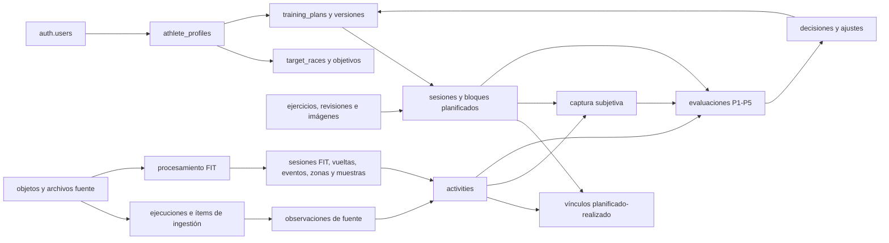

# Modelo de datos — Running Performance App

**Versión:** `APP-002-v3-2026-08-12`  
**Estado:** aprobado para arquitectura e implementación posterior  
**Destino:** Supabase PostgreSQL  
**Contrato funcional:** `APP-001-v4-2026-08-12`

## 1. Alcance y criterio de diseño

Este documento define el modelo lógico del MVP. No aprovisiona Supabase ni crea migraciones; esas acciones corresponden a `APP-005` después de cerrar arquitectura y planificación.

El modelo debe permitir que PostgreSQL sea la fuente histórica consolidada sin perder la relación con el CSV o FIT que originó cada dato. Se priorizan cinco propiedades:

1. identidad estable e idempotencia;
2. procedencia por archivo, ejecución, fila y campo consolidado;
3. separación entre originales inmutables y datos derivados reprocesables;
4. aislamiento por propietario con RLS;
5. consultas directas para historial, plan, P1–P5 y dashboard.

La publicación gratuita agrega una restricción operativa: el modelo conserva el detalle FIT y los originales, pero la aplicación debe vigilar las cuotas de Supabase Free y bloquear nuevas importaciones detalladas antes de excederlas. No se habilitan cobros automáticos para sostener crecimiento.

## 2. Decisiones principales

- Todas las tablas privadas llevan `owner_id uuid NOT NULL`. El valor se deriva de la sesión autenticada y nunca de un identificador libre enviado por el cliente.
- Se usan UUID generados por PostgreSQL para claves internas. `garmin_activity_id` es una identidad externa opcional y `provisional_activity_key` conserva la identidad histórica previa al ID Garmin.
- Las magnitudes consolidadas usan unidades canónicas: metros, segundos, segundos por kilómetro, metros por segundo, bpm, vatios y grados Celsius. La unidad original permanece en la observación de fuente.
- Una ausencia se representa con `NULL`. No se usan ceros, cadenas vacías ni valores FIT centinela como sustitutos.
- La fila consolidada `activities` contiene los campos usados para filtrar, ordenar y calcular. Cada fuente conserva además una observación pequeña en JSONB y la procedencia del valor seleccionado; el JSON canónico FIT completo no se guarda en una fila.
- Los originales CSV/FIT viven como objetos privados en Supabase Storage. PostgreSQL conserva hash, tamaño, ubicación, validación y contexto. No se usa `bytea` para los binarios.
- El detalle FIT se normaliza en sesiones, vueltas, eventos, zonas y muestras. El FIT original permite reconstruir esos derivados.
- No se particiona `activity_samples` en el MVP. Se crean índices por actividad/tiempo. El umbral técnico de partición sigue siendo 10 millones de muestras o 5 GB de tabla, pero el perfil gratuito actúa mucho antes: alerta a 300 MB de base y detiene nuevas importaciones FIT detalladas a 400 MB hasta liberar capacidad de forma auditable.
- Planes publicados, objetivos de carrera, revisiones de ejercicios y auditoría son inmutables. Un cambio crea una nueva versión o un evento compensatorio.
- Las imágenes de ejercicios no se almacenan dentro de PostgreSQL. La base solo conserva URI, orden, texto alternativo, procedencia y licencia.
- El sincronizador local usa una credencial propia, revocable y limitada a carga FIT. El secreto nunca se guarda en claro y su emparejamiento requiere una sesión web del atleta.

## 3. Vista general

## 4. Convenciones transversales

### Identidad y propiedad

- Clave primaria normal: `id uuid DEFAULT gen_random_uuid()`.
- `athlete_profiles.owner_id` es a la vez PK y FK a `auth.users.id`.
- Las tablas hijas incluyen `owner_id` y usan FK compuestas `(owner_id, parent_id)` hacia una clave única equivalente del padre. Esto impide relacionar filas de propietarios distintos incluso si una capa privilegiada omite RLS.
- Timestamps de sistema: `created_at timestamptz`, `updated_at timestamptz`; eventos inmutables usan solo `occurred_at`.

### Tiempo deportivo

- `started_at_local timestamp without time zone` conserva la hora mostrada por el origen.
- `started_at_utc timestamptz NULL` solo existe cuando la fuente permite conocer el instante.
- `timezone_name text NULL` y `utc_offset_minutes smallint NULL` nunca se infieren para el CSV histórico.
- La semana se identifica con `week_start date`, siempre lunes, y `week_end = week_start + 6`.

### Tipos y validación

- Estados y categorías se implementarán inicialmente como `text` con `CHECK`, no como enums PostgreSQL, para permitir evolución mediante migraciones explícitas.
- Duraciones y distancias que pueden tener fracciones usan `numeric`, no texto ni `interval`.
- Rangos de RPE, dolor, fatiga, sueño y recuperación se validan con `CHECK`; un valor desconocido sigue siendo `NULL`.
- Los hashes SHA-256 se guardan como `char(64)` hexadecimal en mayúsculas o minúsculas normalizadas de forma consistente.
- JSONB se limita a snapshots pequeños, criterios, valores antes/después o campos FIT adicionales por mensaje. Nunca reemplaza las columnas de consulta ni contiene el archivo canónico completo.

## 5. Catálogo de tablas

### 5.1 Identidad, perfil y carreras

| Tabla | Propósito | Campos y restricciones principales |
|---|---|---|
| `athlete_profiles` | Perfil privado y preferencias actuales. | `owner_id` PK/FK, nombre visible, fecha de nacimiento opcional, estatura/peso actuales opcionales, `timezone_name`, `locale`, unidades y timestamps. |
| `athlete_health_contexts` | Antecedentes, molestias y restricciones sin convertirlos en diagnósticos. | `id`, `owner_id`, tipo, ubicación corporal, inicio/fin, estado, descripción privada; auditoría obligatoria. |
| `target_races` | Identidad estable de una carrera objetivo. | fecha, distancia en metros, lugar, prioridad A/B/C, estado, zona horaria opcional; índice por propietario/fecha. |
| `race_goal_versions` | Historial inmutable del objetivo de una carrera. | carrera, número de versión, tiempo/ritmo objetivo opcional, clasificación/confianza, motivo, evidencia, `supersedes_id`, vigencia; única versión vigente por carrera. |

### 5.2 Catálogo y guía de ejercicios

| Tabla | Propósito | Campos y restricciones principales |
|---|---|---|
| `exercises` | Identidad estable de un ejercicio del catálogo privado. | `slug`, nombre canónico, patrón de movimiento, equipamiento, estado; `UNIQUE(owner_id, slug)`. |
| `exercise_revisions` | Contenido versionado e inmutable de la guía. | ejercicio, versión, nombre mostrado, descripción de una o dos frases, preparación, ejecución, señales de seguridad y `supersedes_id`. |
| `exercise_media` | Cero, una o dos ilustraciones de una revisión. | revisión, `position` 1–2, `asset_uri`, `alt_text`, tipo MIME, procedencia, autor/licencia y hash opcional; `UNIQUE(revision_id, position)`. |

Las imágenes iniciales serán ilustraciones no personales, propias, generadas o con licencia compatible. Pueden desplegarse como activos versionados del frontend/CDN. La técnica siempre se comunica también mediante texto.

### 5.3 Clientes técnicos de sincronización

| Tabla | Propósito | Campos y restricciones principales |
|---|---|---|
| `sync_clients` | Dispositivo local autorizado para entregar FIT, sin acceso de lectura. | propietario, nombre, identificador público de token, hash con pepper del secreto, scopes, expiración, revocación, último uso y timestamps. Solo admite el scope `fit.upload` en el MVP. |
| `sync_pairing_tokens` | Emparejamiento temporal solicitado desde una sesión web autenticada. | propietario, hash del token aleatorio, expiración máxima de 10 minutos, uso único, cliente resultante y timestamps; nunca conserva el token en claro. |

El token de dispositivo tiene 256 bits aleatorios, vence como máximo en 90 días y se guarda localmente mediante Windows Credential Manager. La revocación no afecta los FIT ya recibidos. Cada uso registra cliente, correlation ID y resultado sin incluir el secreto.

### 5.4 Plan y prescripción

| Tabla | Propósito | Campos y restricciones principales |
|---|---|---|
| `training_plans` | Identidad estable de un ciclo de entrenamiento. | nombre, propósito, fechas objetivo y estado general. |
| `training_plan_versions` | Snapshot inmutable de un plan. | plan, número, periodo, estado `draft/published/superseded/archived`, motivo, `supersedes_id`, `published_at`; una sola versión publicada por propietario. |
| `planned_sessions` | Sesión de una versión del plan. | fecha, tipo, modalidad, obligatoriedad, objetivo, prescripción de distancia/duración/RPE, terreno, calentamiento, bloque principal, recuperaciones y enfriamiento. |
| `planned_session_blocks` | Orden y estructura interna de una sesión. | sesión, posición, tipo `warmup/main/cooldown/circuit/mobility`, repeticiones del bloque e instrucciones breves. |
| `planned_session_exercises` | Prescripción de ejercicios dentro de un bloque. | bloque, revisión de ejercicio, posición, series, repeticiones mín/máx, duración, descanso, carga/unidad, RPE o RIR, tempo, lado y nota. Al menos una forma de dosificación debe existir. |

Una versión publicada no se edita. Una adaptación crea otra `training_plan_version`; las sesiones anteriores permanecen consultables y los cambios exactos se registran en `plan_adjustments`.

### 5.5 Actividad consolidada

| Tabla | Propósito | Campos y restricciones principales |
|---|---|---|
| `activities` | Una actividad lógica, sin duplicar CSV y FIT. | claves provisional/Garmin opcionales, tipo/categoría/modalidad, inicio local/UTC, título, distancia, duración, tiempo en movimiento/transcurrido, ritmo, velocidad, calorías, FC, cadencia, potencia, desnivel, vueltas y estado de validación. |
| `metric_definitions` | Catálogo controlado para métricas resumen menos frecuentes. | código estable, tipo de valor, unidad canónica, categoría y regla de comparabilidad. Seed versionado, no editable desde la UI. |
| `activity_metric_values` | Valor canónico opcional que no merece una columna de primer nivel. | actividad, definición, un solo valor `numeric/boolean/text`, observación seleccionada y unidad; `UNIQUE(activity_id, metric_definition_id)`. |
| `activity_source_observations` | Representación pequeña de una actividad desde una fuente concreta. | actividad, archivo, ítem de ingestión, clase `normalized_csv_row/fit_session/manual`, fila fuente, claves observadas, `summary_payload jsonb`, timestamps y resultado de enlace. |
| `activity_field_sources` | Procedencia del valor consolidado elegido. | actividad, nombre controlado de campo, observación, regla de precedencia y timestamp; una fuente seleccionada por campo. |

Restricciones de identidad:

- índice único parcial `(owner_id, provisional_activity_key)` cuando no sea nulo;
- índice único parcial `(owner_id, garmin_activity_id)` cuando no sea nulo;
- al menos una identidad de fuente debe existir al publicar una actividad importada;
- un ID Garmin conocido con otro hash no actualiza `activities`: crea cuarentena;
- un FIT solo añade su ID a una actividad histórica si el enlace es único según fecha local, deporte, duración y distancia.

Los campos de primer nivel cubren los filtros y agregados frecuentes. `activity_metric_values` conserva, con tipos y unidades, métricas como dinámica de carrera, GAP, temperatura, respiración, Body Battery, SWOLF, ciclos, pasos, repeticiones o series. `training_stress_score` puede importarse con procedencia, pero queda marcado como excluido y no alimenta decisiones.

### 5.6 Archivos, importaciones y cuarentena

| Tabla | Propósito | Campos y restricciones principales |
|---|---|---|
| `stored_objects` | Blob físico inmutable y deduplicable. | bucket, path privado, SHA-256, tamaño, MIME, cifrado/retención; `UNIQUE(owner_id, sha256)`. |
| `source_files` | Recepción lógica y contexto de un archivo. | objeto, clase `normalized_csv/fit/export`, nombre original, vía `historical_import/incremental/manual`, ID Garmin declarado, estado y timestamps. Varios contextos pueden apuntar al mismo blob. |
| `ingestion_runs` | Trabajo histórico de importación, sincronización o reproceso y cola persistente. | tipo, estado, versión de herramienta/esquema/SDK, correlation ID, inicio/fin, conteos, `lease_owner`, `lease_until`, heartbeat, intentos y `next_attempt_at`. |
| `ingestion_items` | Resultado por fila o archivo. | ejecución, ordinal/fila, archivo, claves observadas, actividad destino, estado, acción, código/mensaje de error y reintento. |
| `fit_processing_attempts` | Validación y extracción de un FIT con una versión concreta. | archivo, ejecución, procesador/SDK/esquema, firma/tamaño/CRC/lectura, hash, conteos, estado y `is_current`. |
| `fit_processing_warnings` | Advertencias agregadas del procesador. | intento, código, mensaje global/campo, cantidad y mensaje sanitizado. |
| `fit_schema_observations` | Definiciones conocidas o desconocidas observadas. | intento, tipo/número global, campo/número, tipo base, unidad, perfil, developer flag y conteos válidos/inválidos. |
| `quarantine_cases` | Conflictos, ambigüedades o archivos inválidos. | archivo/ítem, razón, detalles, estado `open/resolved/rejected`, resolución, actor y timestamps. No elimina ni sobrescribe el origen. |

`stored_objects` separa contenido de recepción: el mismo hash presentado con dos IDs Garmin conserva ambos contextos y se envía a revisión sin duplicar el binario.

La carga CSV usa dos fases. Primero valida y registra sus 460 `ingestion_items`; solo si el lote completo es válido aplica el upsert de actividades en una transacción. Un fallo deja evidencia por fila, pero ninguna carga parcial publicada. Repetir el mismo archivo y contrato produce omisiones seguras, no duplicados.

### 5.7 Detalle FIT normalizado

| Tabla | Propósito | Campos principales |
|---|---|---|
| `activity_fit_sessions` | Una o más sesiones extraídas de un FIT. | actividad, intento, secuencia, deporte/subdeporte, inicio, duración/distancia y resúmenes grabados. |
| `activity_laps` | Vueltas ordenadas. | sesión FIT, índice, inicio/fin, duración/distancia y resúmenes de FC, cadencia, potencia, desnivel. |
| `activity_events` | Eventos FIT. | actividad/sesión, índice, timestamp, evento, tipo, grupo, dato y campos adicionales pequeños. |
| `activity_time_in_zones` | Arrays FIT normalizados a una fila por zona. | actividad/sesión, tipo de zona, índice, límites, segundos y referencia. |
| `activity_samples` | Muestras `Record` ordenadas. | actividad, índice, timestamp, distancia, posición, altitud, velocidad, FC, cadencia, potencia, temperatura y `additional_fields jsonb` limitado. |

La escritura de detalle se hace por lotes dentro de la transacción de una actividad. Un reproceso construye un conjunto temporal, valida conteos y cambia el conjunto vigente de forma atómica. Los derivados anteriores de gran volumen pueden eliminarse después del swap porque el FIT original, hashes, versión, conteos y auditoría permanecen; nunca se elimina el original como parte del reproceso.

No se almacenan miles de mensajes desconocidos solo para duplicar el FIT. Sus esquemas y advertencias se conservan, y el original permite reprocesarlos cuando un SDK futuro conozca su semántica.

### 5.8 Planificado frente a realizado y captura subjetiva

| Tabla | Propósito | Campos y restricciones principales |
|---|---|---|
| `activity_session_links` | Historial del vínculo entre actividad y sesión. | actividad, sesión, método `automatic/manual`, criterios, confianza, estado `proposed/confirmed/withdrawn/rejected`, `supersedes_id`, actor y tiempo. Solo un vínculo activo por actividad. |
| `planned_session_outcomes` | Resultado de una sesión aunque no tenga actividad. | sesión, estado de los cinco valores TRN-003, razón de modificación/omisión y confirmación. |
| `session_checkins` | Captura subjetiva inmediata, 24 h o 48 h. | actividad y/o sesión, ventana, RPE, dolor/ubicación, cambio de zancada, fatiga, sueño, recuperación, enfermedad/síntoma y nota; sin imputación retrospectiva. |

El sRPE se calcula en una vista como `duration_seconds / 60 × session_rpe`. No se confunde con TSS, calorías ni carga fisiológica. El snapshot de una evaluación semanal puede persistir el resultado que se utilizó para decidir.

### 5.9 Evaluación, decisión y auditoría

| Tabla | Propósito | Campos y restricciones principales |
|---|---|---|
| `weekly_evaluations` | Cabecera de una evaluación de lunes a domingo. | semana, versión de formato/plan, corte, estado `provisional/final`, semáforo, motivo y timestamps. Una final por semana; pueden existir revisiones explícitas. |
| `weekly_evaluation_sessions` | Fuentes de sesión incluidas en el snapshot. | evaluación, sesión/actividad, clasificación y estado de ejecución. |
| `weekly_metric_values` | Componentes escalares de P1–P5 y contexto. | evaluación, código P1–P5/C1–C4, dimensión, un valor tipado, unidad, estado y fórmula/versión. P5 usa filas separadas, nunca un score compuesto. |
| `weekly_metric_evidence` | Navegación desde agregado a fuentes. | métrica, actividad, sesión, check-in u observación; exactamente una referencia fuente por fila. |
| `weekly_decisions` | Decisión humana confirmada. | evaluación, decisión, observación, evidencia, comparación, interpretación, recomendación, actor y timestamp. |
| `plan_adjustments` | Cambios exactos derivados de una decisión. | decisión, plan origen/destino, objetivo afectado, tipo, `before jsonb`, `after jsonb`, motivo y criterio de revisión. |
| `notes` | Notas privadas vinculables a carrera, actividad, sesión o evaluación. | texto, tipo y una sola referencia destino. |
| `audit_events` | Bitácora append-only de cambios sensibles y operativos. | actor, tipo, acción, entidad, correlation ID, campos cambiados, detalle mínimo y timestamp. No contiene binarios ni payloads completos. |
| `export_jobs` | Preparación y retención de exportaciones del atleta. | formato/esquema, estado, objeto privado, solicitud, finalización y expiración. |
| `lifecycle_requests` | Solicitud explícita de archivar o eliminar datos. | alcance, razón, estado, aprobaciones, ejecución y evidencia; evita borrados implícitos. |

## 6. Precedencia y consolidación de fuentes

| Campo o conjunto | Fuente preferida | Comportamiento |
|---|---|---|
| ID externo | Contexto de descarga/URL Garmin | Nunca se infiere del FIT. |
| Clave histórica | Staging normalizado | Se conserva aunque después exista ID Garmin. |
| Resumen grabado por dispositivo | FIT validado | Solo un valor presente puede sustituir el consolidado. |
| GAP, Body Battery y derivados Connect ausentes en FIT | CSV normalizado | Una ausencia FIT nunca los borra. |
| Vueltas, eventos, zonas, ruta y muestras | FIT validado | Se asocian al intento vigente y al original. |
| Captura subjetiva | Entrada explícita del atleta | No se reconstruye desde Garmin ni se imputa. |
| Plan y decisiones | Versión publicada/decisión confirmada | Una sugerencia automática no cambia datos vigentes. |

Cada cambio consolidado registra una `activity_field_sources`. Una discrepancia material crea evidencia y, si compromete identidad o integridad, `quarantine_cases`. No existe un upsert genérico que reemplace valores por `NULL`.

## 7. RLS y autorización

1. RLS se habilita y se fuerza en toda tabla privada.
2. Política base de atleta autenticado: `owner_id = auth.uid()` para `SELECT`, `INSERT`, `UPDATE` y las eliminaciones permitidas.
3. Los inserts comprueban `WITH CHECK (owner_id = auth.uid())`; el frontend no puede elegir otra identidad.
4. Tablas inmutables (`race_goal_versions` vigentes/publicadas, versiones de plan publicadas, revisiones de ejercicios usadas, archivos aceptados y `audit_events`) no permiten `UPDATE/DELETE` al rol autenticado.
5. El sincronizador local llama al backend con una credencial restringida. El backend resuelve al propietario y usa procedimientos transaccionales; no acepta `owner_id` desde el FIT o body.
6. `service_role`, si APP-003 la autoriza, permanece solo en backend. Cada operación privilegiada valida propietario, alcance y correlation ID porque `service_role` omite RLS.
7. `audit_events` admite lectura del propietario; la escritura normal ocurre mediante funciones/backend y es append-only.
8. Las rutas Storage empiezan por el UUID del propietario y sus políticas validan ese primer segmento. Los objetos de ejercicio públicos solo pueden ser activos no personales revisados.
9. `sync_clients` y `sync_pairing_tokens` no se consultan directamente desde el navegador: el backend crea, canjea y revoca credenciales; solo devuelve el secreto una vez.

## 8. Índices y restricciones críticas

- `activities(owner_id, started_at_local DESC, id)` para historial paginado estable.
- `activities(owner_id, activity_category, modality, started_at_local DESC)` para tendencias comparables.
- índices únicos parciales de clave provisional e ID Garmin.
- `planned_sessions(owner_id, scheduled_date, id)` y `training_plan_versions(owner_id, status)` con único parcial para la publicada.
- `ingestion_runs(owner_id, started_at DESC)` e `ingestion_items(run_id, status)`.
- `source_files(owner_id, declared_garmin_activity_id)` y `stored_objects(owner_id, sha256)`.
- `activity_samples(activity_id, sample_index)` PK y `(activity_id, recorded_at_utc)`; BRIN por tiempo solo cuando el volumen lo justifique.
- `activity_laps(activity_id, lap_index)`, `activity_events(activity_id, event_index)` y zonas por actividad/tipo/índice.
- `weekly_evaluations(owner_id, week_start DESC)` y `weekly_metric_values(evaluation_id, metric_code, dimension)`.
- checks de rangos, valores tipados exclusivos, semana lunes-domingo, media de ejercicio 0–2 y conteos no negativos.

La búsqueda textual avanzada, PostGIS y partición quedan fuera del MVP porque no son necesarias para los criterios actuales.

## 9. Vistas y funciones derivadas previstas

- `v_activity_history`: actividad consolidada con procedencia resumida, paginable por cursor.
- `v_activity_srpe`: duración, RPE inmediato y sRPE calculado.
- `v_planned_vs_completed`: sesión vigente, vínculos activos y resultado TRN-003.
- `v_weekly_running`: distancia/tiempo total con separación treadmill/outdoor.
- `v_weekly_p1_to_p5_sources`: entradas trazables para la evaluación.
- `v_current_race_goals`, `v_current_training_plan` y `v_current_exercise_revisions`.

Las vistas calculan datos actuales. `weekly_metric_values` conserva el snapshot exacto utilizado al cerrar una evaluación, junto con fórmula y evidencia.

## 10. Conservación y respaldo

- Bucket privado propuesto: `athlete-files`, con prefijos por propietario y clase (`csv`, `fit`, `export`). No hay URLs públicas permanentes.
- El original aceptado es inmutable. Cuarentena es un estado de acceso/procesamiento; no implica borrar el objeto.
- FIT y CSV se conservan mientras sean necesarios para reproducir la historia. Una eliminación requiere `lifecycle_requests` y debe considerar respaldo/auditoría.
- Las exportaciones generadas son temporales y tienen `expires_at`; sus metadatos permanecen para auditoría.
- Las muestras se conservan inicialmente. Si el volumen exige archivo frío, primero se prueba reconstrucción desde FIT y se registra una política explícita.
- Supabase Storage alerta a 700 MB y detiene nuevas cargas a 850 MB. Alcanzar un umbral degrada o pausa la ingestión; nunca habilita facturación automáticamente.
- En el plan gratuito, el respaldo descargable se ejecuta fuera del servicio publicado con `supabase db dump` y exportación de objetos privados, cifrado y fuera de Git. La restauración debe probarse antes de declarar Supabase fuente única.

## 11. Trazabilidad de requerimientos

| Grupo APP-001 | Componentes principales |
|---|---|
| AUTH/PRO/RACE | perfil, contexto de salud, carreras, objetivos y RLS por propietario |
| PLAN/EXE | planes/versiones, sesiones/bloques, catálogo/revisiones/imágenes de ejercicios |
| SYNC | clientes técnicos y emparejamientos de un solo uso con alcance `fit.upload` |
| ACT/CSV/FIT | actividad consolidada, observaciones, objetos, ejecuciones, procesamiento y detalle FIT |
| MATCH/CAP | vínculos versionados, resultados de sesión y check-ins por ventana |
| EVAL/DEC/DASH | evaluaciones, componentes P1–P5, evidencia, decisiones, ajustes y vistas |
| EXP/SEC/DAT/OPS | exportaciones, lifecycle, auditoría, Storage privado, idempotencia y reconciliación |

## 12. Puertas para la implementación

Antes de `APP-005`, `APP-003` deberá decidir el límite exacto entre API .NET, Data API de Supabase y funciones SQL, además del mecanismo de autenticación del sincronizador local. `APP-004` convertirá este catálogo en migraciones por etapas.

La implementación deberá probar como mínimo:

1. aislamiento RLS entre dos propietarios sintéticos;
2. doble importación CSV sin duplicados y con 460 filas reconciliables;
3. `NULL` preservado y FIT ausente sin borrar CSV;
4. conflicto ID/hash enviado a cuarentena;
5. reproceso FIT transaccional con los mismos conteos;
6. una sola versión de plan publicada y versiones anteriores inmutables;
7. guía de fuerza ordenada con descripción y cero a dos imágenes accesibles;
8. un solo vínculo activo por actividad y retiro sin borrar origen;
9. P5 sin score compuesto y agregados navegables hasta sus fuentes;
10. auditoría append-only y objetos privados no accesibles por otro propietario.
11. emparejamiento de sincronizador de un solo uso, expiración y revocación sin acceso de lectura.
12. alertas y bloqueo preventivo de ingestión al alcanzar los umbrales gratuitos de base y Storage, sin habilitar cobros.
